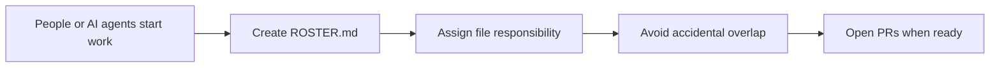

# roster

> Prevent AI coding agents from overwriting each other.

roster helps teams using Claude Code, Cursor, Windsurf, and Codex work on the same repo without accidentally editing the same files.

It creates a simple `ROSTER.md` before a PR exists, so multiple AI tools or teammates can agree on who is touching which files before work collides.



---

## Problem

```text
Claude edits auth.
Codex edits auth.
Cursor edits auth.

Nobody knows until the work collides.
```

Git can show you what changed after the fact. CODEOWNERS can request review after a PR exists. roster helps before that: at the moment multiple people or AI agents start working in the same repo.

---

## Solution

Start a roster session. The assistant writes `ROSTER.md`:

```md
| File / Directory | Session Owner | Consult / Notify | Notes |
|------------------|---------------|------------------|-------|
| src/auth/        | Claude        | Codex            | login flow |
| src/admin/       | Codex         | Claude           | admin UI |
| src/theme/       | ALL           | ALL              | needs agreement |
| package.json     | ALL           | ALL              | shared dependency risk |
```

Now each collaborator knows what to avoid, what needs agreement, and where overlap is likely.

---

## Install

Run this from your project root:

```bash
git clone --depth 1 https://github.com/idahsueh-cmd/roster-skill /tmp/roster-skill
mkdir -p .roster
cp -r /tmp/roster-skill/project-setup/. .roster/
rm -rf /tmp/roster-skill
python .roster/generate.py
```

Then restart your AI session and say:

```text
let's start a roster session
```

See [docs/install.md](docs/install.md) for update, direct-use, and generated-file details.

---

## Example

```text
User: let's start a roster session

AI: Does everyone already have repo access?
AI: Who is working today, and what is each person building?
AI: Any sensitive files or areas?

User: Codex: admin roster UI / Claude: CSV import API
```

The assistant scans the repo, marks likely ownership, and flags shared files like `package.json`, route files, API contracts, theme files, and CODEOWNERS as `ALL`.

---

## Why not CODEOWNERS?

Use both. They solve different moments in the workflow.

| Need | CODEOWNERS | roster |
|------|------------|--------|
| Long-term file responsibility | Yes | No |
| Automatic PR review requests | Yes | No |
| Required owner approval before merge | Yes | No |
| Pre-PR session planning | No | Yes |
| Temporary "who touches what today" coordination | No | Yes |
| Multi-agent conflict prevention before commits land | No | Yes |

roster reads CODEOWNERS as context for sensitive areas. It does not replace CODEOWNERS, branch protection, issue trackers, or PR review.

---

## Supported tools

- Claude Code
- Codex
- Cursor
- Windsurf

`project-setup/PROTOCOL.md` is the single source of truth. Tool-specific prompts are thin wrappers that execute START, CONFLICT, STATUS, JOIN, or WRAP from that protocol.

---

## More

- [Advanced docs](docs/advanced.md)
- [Installed `.roster/` guide](project-setup/README.md)
- [Protocol source](project-setup/PROTOCOL.md)
- [Tests](tests/test_generate.py)

Run tests:

```bash
python -m unittest tests.test_generate
```

[MIT](LICENSE)
